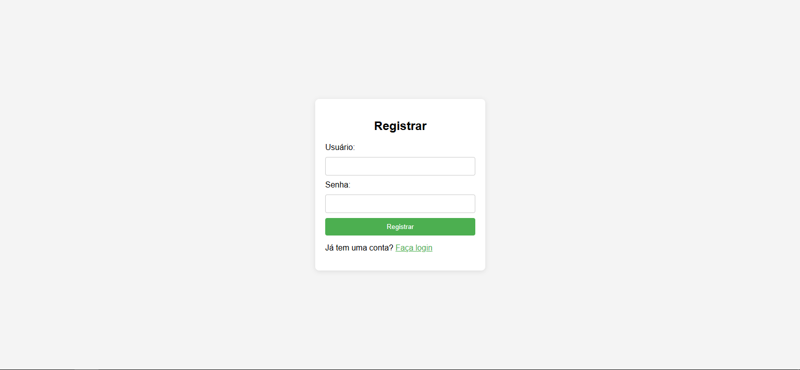
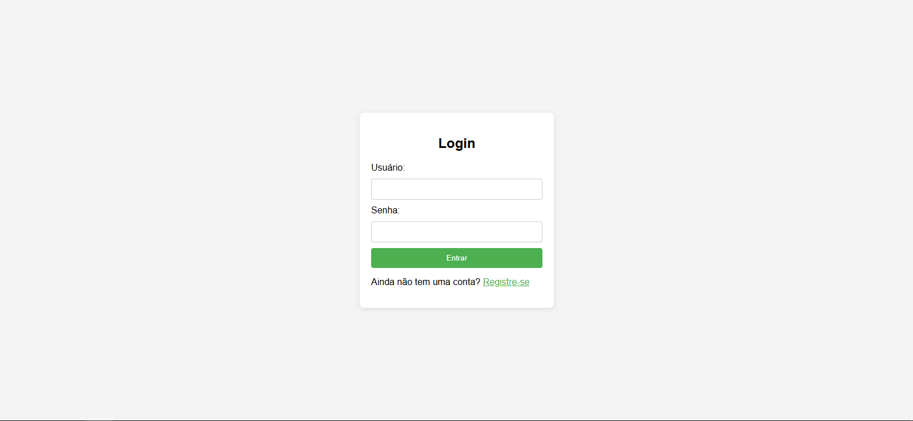

# Node.js Login System

Sistema de login com autenticação de usuários utilizando **Node.js**, **MySQL**, **JavaScript**, **HTML** e **CSS**. Este projeto oferece funcionalidades de registro e login de usuários, com validação de dados e armazenamento seguro de senhas.

## Tabela de Conteúdo
- [Tecnologias](#tecnologias)
- [Funcionalidades](#funcionalidades)
- [Como Rodar o Projeto](#como-rodar-o-projeto)
- [Demonstração](#demonstração)
- [Contribuições](#contribuição)
- [Licença](#licença)

## Tecnologias

- **Node.js**: Ambiente de execução JavaScript no servidor.
- **MySQL**: Banco de dados utilizado para armazenar os dados dos usuários.
- **JavaScript**: Linguagem de programação usada no backend (Node.js) e possivelmente no frontend (validação, interatividade).
- **HTML/CSS**: Frontend simples para exibir a interface de login e registro.

### Dependências Principais

- **bcrypt**: Para hash de senhas e segurança.
- **dotenv**: Para gerenciamento de variáveis de ambiente.
- **express**: Framework Node.js para criação do servidor.
- **mysql2**: Cliente MySQL para Node.js.

## Funcionalidades

- Registro de usuários com validação de dados.
- Login de usuários com verificação de senha.
- Feedback visual para erros de validação (ex.: campos obrigatórios).
- Armazenamento seguro de senhas (utilizando hashing).

## Como Rodar o Projeto

### 1. Clone o Repositório

```sh
git clone https://github.com/rafa-e-alves/Nodejs-Login-System.git
```

### 2. Entre no Diretório do Projeto

```sh
cd nodejs-login-system
```

### 3. Instale as Dependências

```sh
npm install
```

### 4. Configure o Banco de Dados

Antes de rodar o servidor, você precisa configurar o banco de dados MySQL.

- Crie um banco de dados chamado `user_management` e configure a tabela users:

```sh
CREATE DATABASE user_management;

USE user_management;

CREATE TABLE users (
    id INT AUTO_INCREMENT PRIMARY KEY,
    username VARCHAR(50) NOT NULL,
    password VARCHAR(255) NOT NULL
);
```

- No arquivo **`.env`**, adicione:

```sh
DB_PASSWORD=SUA_SENHA
```

- No arquivo **`server.js`**, verifique a configuração da conexão com o banco:

```sh
const db = mysql.createConnection({
  host: 'localhost',
  user: 'root',
  password: process.env.DB_PASSWORD,
  database: 'user_management'
});
```

### 5. Inicie o Servidor

```sh
npm start
```
Acesse o sistema de login em http://localhost:3000/login.

## Demonstração

### Tela de Registro


### Tela de Login


## Contribuição

Sinta-se à vontade para contribuir com melhorias no código ou na documentação. Para isso, abra um *issue* ou envie um *pull request* com as suas alterações.

## Licença

Este projeto está licenciado sob a MIT License - Consulte o [MIT](https://opensource.org/license/MIT) para mais detalhes.
